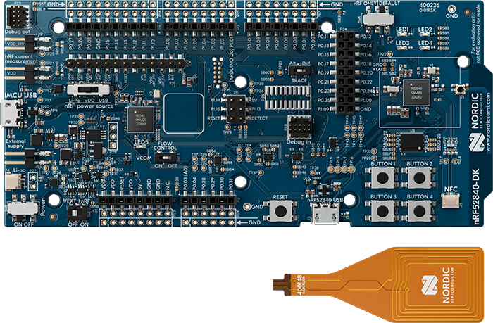

# Available hardware

For all exercises as well as the final submission you have a
[Nordic NRF 52840DK](https://docs.nordicsemi.com/bundle/ug_nrf52840_dk/page/UG/dk/intro.html)
shown below:

Along with it comes a [BOSCH BMP280](https://www.bosch-sensortec.com/media/boschsensortec/downloads/datasheets/bst-bmp280-ds001.pdf)
pressure and temperature sensor to measure some parameters of your surroundings.
Additionally, you have a [Grove Ultrasonic
Ranger](https://media.digikey.com/pdf/Data%20Sheets/Seeed%20Technology/Grove_Ultrasonic_Ranger_101020010_Web.pdf)
which is a fairly simple ultrasonic distance sensor.

> **Note:** Do not use this until we discussed it in class.
> Wiring/Configuring it incorrectly can actually damage the chip!

In order to operate the device, you need to plug a Micro-USB cable into the `MCU USB` slot on the
**short** end of the device.
Two USB devices will show up - a SEGGER JLink debugger (used for flashing and debugging), as well as
serial device for communication.
The latter is typically named `/dev/ttyACM0`.
